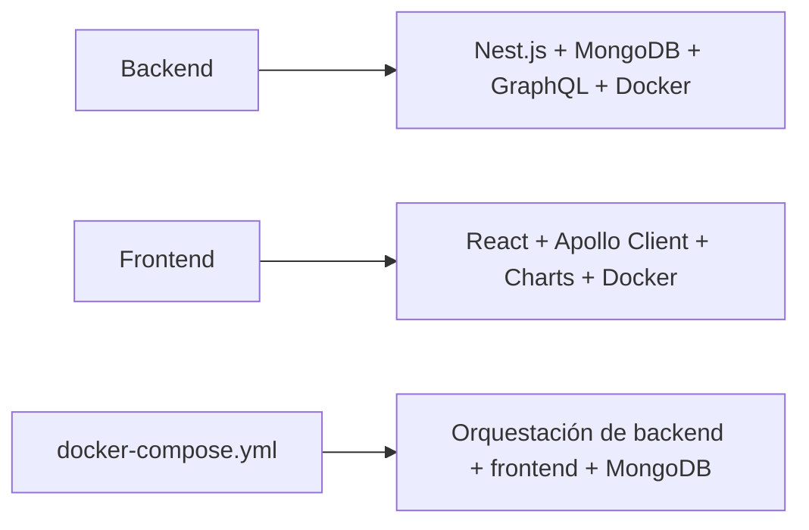

# Bienvenidos al reto!

Construir un sistema Fullstack que obtenga datos en tiempo real desde la API pública de **REE (Red Eléctrica de España)** — específicamente los datos de **Balance Eléctrico** —, los almacene en una base de datos **MongoDB**, y los exponga mediante una **API GraphQL**. Además, debe incluir un **frontend en React** que consuma esa API y muestre la información de forma clara e interactiva.

El sistema debe estar **contenedorizado con Docker** y contar con **testing y documentación adecuados**.

🔌 Data Source and API
Usar el siguiente endpoint público de REE:
📍 https://apidatos.ree.es/es/datos/balance/balance-electrico
Este endpoint proporciona información del balance eléctrico nacional: generación, demanda, importaciones/exportaciones, etc.
Tu backend debe:
•	Consultar la API de forma periódica.
•	Almacenar los datos en MongoDB.
•	Exponer la información mediante una API GraphQL para que el frontend la consuma.


# Estructura

/ree-balance



## Como Iniciar

**1-** Abrir terminal en el directorio, *ree-balance* y ejecutar
```
docker-compose up -d
```
**2-** Hacer fetch manual al servicio de REE para descargar algo de data. Navega al siguiente link: 
```
http://localhost:3000
```
Cada una hora se ejecuta un proceso, el mismo proceso de forma interna. Pero con la llamada anterior se ejecuta de inmediato.

**2-** Para ver la gráfica de los datos descargados ejecutar el siguiente link:
```
http://localhost:3001
```
Se ha seleccionado para mostrar los datos de la generación de energía renovable Hidráulica y como datos de demanda consumo de Demanda en B.C.


**3-** Para ejecutar las pruebas unitarias:
```
npm run test
```

